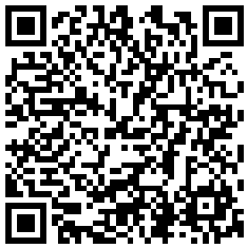

# 知乎日报weex版本

@author:莫川

### 说明

API接口来源：https://github.com/izzyleung/ZhihuDailyPurify/wiki/%E7%9F%A5%E4%B9%8E%E6%97%A5%E6%8A%A5-API-%E5%88%86%E6%9E%90

### 使用说明

使用Weex 的官方PlayGround，扫描下列二维码：<br>


<br>weex首页二维码

<br>

生成的js文件地址：

```
http://nuptboyzhb.oss-cn-shanghai.aliyuncs.com/home.js
```

**主要功能：**

- 首页列表展示
- 下拉刷新
- 上拉加载更多

### TODO
- 帖子详情页
- 评论页